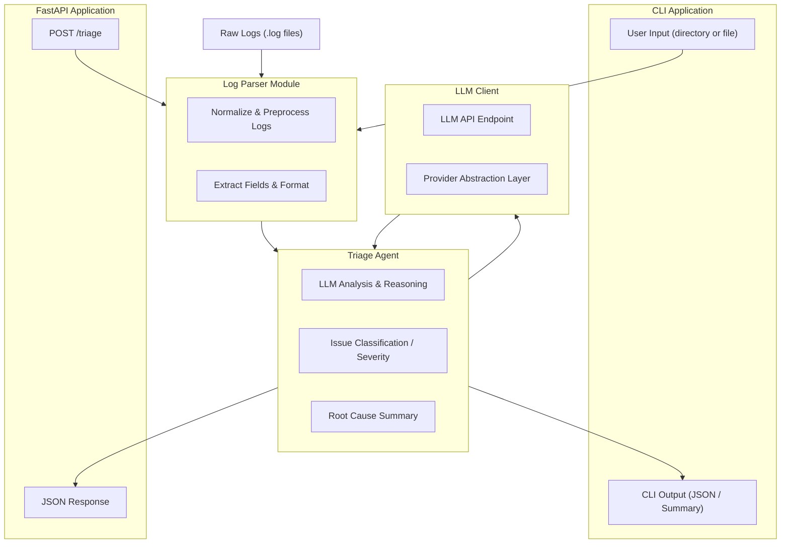

# AI Log Triage Agent

AI-powered developer-centric log triage engine -> ***not a log parser***.

## Description

AI Log Triage Agent is an LLM-driven triage engine designed for DevOps, SRE, and engineering teams who need actionable insights from logs.

Unlike traditional log tools that focus on parsing, ingestion, or visualization, this project focuses on:

- Understanding logs

- Summarizing what matters

- Clustering related events

- Suggesting next steps

- Identifying likely owners

- Prioritizing incidents

- Integrating into actual engineering workflows (CLI, API, automation)

This project is model agnostic, supports local or hosted LLMs, and is architected to evolve alongside the rapidly changing AI ecosystem.

The goal is to build both:

- A **CLI tool** for quick experiments and demos
- A **FastAPI service** for integration and further research

This project will also serve as a foundation for potential **research work** on LLM-based triage and developer productivity.

---

## Overview

Modern teams already have great log ingestion tools (ELK, Loki, Datadog, Splunk), but they all suffer the same pain point:

Too many logs → too little actionable insight → slow triage → slow recovery.

AI Log Triage Agent solves this by adding a smart triage layer on top of any log source.


### What the tool does:
- Takes raw logs (files, batches, or API input)

- Parses them lightly (only enough to structure context)

- Uses LLM reasoning to produce:
  - Human-readable summaries

  - Root-cause hypotheses

  - Suggested fixes

  - Recommended owning team/service

  - Severity score

  - Clustered related events


### What the tool intentionally does NOT do:

- Compete with log ingestion platforms

- Replace ELK / Loki / Datadog, etc.

- Build complex dashboards

- Replace anomaly detection systems


### Why this matters:

This project focuses on the triage layer — the missing middle piece between raw logs and human decisions.
That’s where LLMs shine and where existing open-source tools fall short.

---

## Features

- **Intelligent Log Parsing**: Automatically detects and groups multi-line log events (e.g., stack traces)
- **LLM-Powered Analysis**: Uses any compatible LLM API endpoint for log analysis
- **Comprehensive Triage**: Provides:
  - Summary of each log event
  - Classification (Database Error, Auth Failure, etc.)
  - Priority level (CRITICAL, HIGH, MEDIUM, LOW, INFO)
  - Suggested owner/team
  - Root cause analysis
  - Actionable items for resolution
- **Flexible CLI**: Easy-to-use command-line interface with multiple output formats
- **Multiple Output Formats**: Text, JSON, YAML, Markdown, and summary reports
- **Structured Output**: Machine-readable output with rich metadata for dashboards, automation, and analytics
- **REST API**: FastAPI-based service for integration with existing workflows

---

## Architecture Overview

The AI Log Triage Agent follows a modular, production-ready architecture designed for flexibility, extensibility, and ease of experimentation with different LLMs and parsing strategies.

### High-Level Flow
1. **Log Ingestion**
   - Logs can be provided through the CLI or FastAPI endpoint (`/triage`).
   - Users can submit a single file, a directory, or raw log text.

2. **Log Parsing**
   - The `LogParser` module normalizes logs, extracts key fields (timestamps, severity, message), and prepares structured records.
   - Designed for future expansion (JSON logs, multi-line stack traces, embedded metadata).

3. **Triage Agent**
   - Orchestrates the analysis workflow.
   - Generates prompts, passes data to the LLM, and applies classification rules (severity, type, suggested owner team).
   - Returns structured JSON.

4. **LLM Client Abstraction**
   - Supports any OpenRouter-compatible API endpoint.
   - Future-proof abstraction allows plugging in different LLM providers or local models without changing business logic.

5. **Output Layer**
   - **CLI mode** supports multiple formats: text, JSON, structured JSON, YAML, Markdown
   - **API mode** returns structured responses with rich metadata for integration with dashboards, monitoring systems, or external services
   - **Structured output** includes summary statistics, priority/classification breakdowns, performance metrics, and actionable item tracking

### High-Level Diagram



---

## Project Status

- [x] v0 — Basic CLI that summarizes a single log file via an LLM
- [x] v0.1 — Basic FastAPI endpoint wrapping the same logic
- [ ] v1.0 — Clustering + prioritization + simple heuristics
- [ ] v1.1 — Initial experiment design + metrics
- [ ] v2.0 — Writeup suitable as a short paper / technical report

---

## Installation

### Option 1: Install as Package (Recommended)

```bash
cd projects/ai-log-triage-agent

# Create and activate virtual environment
python -m venv .venv

# macOS/Linux:
source .venv/bin/activate

# Windows PowerShell:
.\.venv\Scripts\Activate.ps1

# Windows CMD:
.\.venv\Scripts\activate.bat

# Install the package in editable mode
pip install -e .
```

This installs the package and creates an `ai-log-triage` command available in your PATH.

### Option 2: Development Mode (requirements.txt)

```bash
cd projects/ai-log-triage-agent
python -m venv .venv
source .venv/bin/activate  # or Windows equivalent
pip install -r requirements.txt
```

Use this for development without installing the package.

## Configuration

The tool uses OpenRouter API for LLM access. Make sure your `.env` file has the required API keys:

```env
LLM_OPENROUTER_API_KEY=your-api-key-here
LLM_ENDPOINT=https://openrouter.ai/api/v1/chat/completions
LLM_DEFAULT_MODEL=your-default-model-here
```

---

## Usage

### FastAPI Server

Start the REST API server:

```bash
# Development mode (auto-reload enabled)
python run_api.py

# Production mode
python run_api.py --production --workers 4

# Custom host and port
python run_api.py --host 0.0.0.0 --port 5000
```

Once running, access:
- **Swagger UI (interactive docs)**: http://localhost:8000/docs
- **ReDoc (alternative docs)**: http://localhost:8000/redoc
- **Health check**: http://localhost:8000/health

#### API Endpoints

**Single Log Triage** - `POST /triage`
```bash
curl -X POST http://localhost:8000/triage \
  -H "Content-Type: application/json" \
  -d '{
    "log_text": "2025-02-17 14:23:11 ERROR: Database connection timeout",
    "source_file": "webserver.log"
  }'
```

**Batch Log Triage** - `POST /triage/batch`
```bash
curl -X POST http://localhost:8000/triage/batch \
  -H "Content-Type: application/json" \
  -d '{
    "logs": [
      "2025-02-17 14:23:11 ERROR: Database timeout",
      "2025-02-17 14:24:15 WARN: High memory usage"
    ],
    "source_file": "app.log"
  }'
```

**Batch Log Triage (Structured)** - `POST /triage/batch/structured`

For dashboards, automation, and analytics - includes rich metadata:

```bash
curl -X POST http://localhost:8000/triage/batch/structured \
  -H "Content-Type: application/json" \
  -d '{
    "logs": [
      "2025-02-17 14:23:11 ERROR: Database timeout",
      "2025-02-17 14:24:15 WARN: High memory usage"
    ],
    "source_file": "app.log"
  }'
```

**Response includes:**
- Summary metadata (counts, duration, performance metrics)
- Priority, classification, and owner breakdowns
- Actionable item tracking
- Individual triage results

See [API_EXAMPLES.md](API_EXAMPLES.md) and [STRUCTURED_OUTPUT.md](STRUCTURED_OUTPUT.md) for detailed examples and integration patterns.

---

### CLI Usage

The CLI can be run in multiple ways depending on your installation method:

### If Installed as Package (Option 1)

After running `pip install -e .`, you can use the `ai-log-triage` command:

```bash
# Analyze a single log file
ai-log-triage --input data/webserver_error.log

# Analyze all logs in data directory
ai-log-triage --all

# Dry run to test parsing
ai-log-triage --all --dry-run --max-events 3
```

### Using python -m

```bash
# Run as a module
python -m ai_log_triage --input data/webserver_error.log
```

### Development Mode (main.py wrapper)

For development without installation:

```bash
python main.py --input data/webserver_error.log
python main.py --all --dry-run
```

### Advanced Options

**Save results to a file:**
```bash
# Simple JSON output
ai-log-triage --input data/auth_failures.log --output results.json --format json

# Structured JSON with metadata (recommended for automation)
ai-log-triage --input data/auth_failures.log --output results.json --format structured-json

# YAML format
ai-log-triage --input data/auth_failures.log --output results.yaml --format yaml

# Markdown report
ai-log-triage --input data/auth_failures.log --output report.md --format markdown
```

**Filter by priority:**
```bash
ai-log-triage --all --priority-filter HIGH
```

**Use a different model:**
```bash
# Specify model identifier from your LLM provider
ai-log-triage --input data/java_exception.log --model your-preferred-model
```

**Line-by-line processing:**
```bash
ai-log-triage --input data/deployment_pipeline.log --chunk-method line
```

**Summary report only:**
```bash
ai-log-triage --all --format summary
```

**Verbose output:**
```bash
ai-log-triage --input data/security_event.log --verbose
```

**Dry run (parse without calling LLM):**
```bash
ai-log-triage --all --dry-run
```

**Limit number of events:**
```bash
ai-log-triage --all --max-events 5
```

### CLI Arguments

| Argument | Short | Description |
|----------|-------|-------------|
| `--input PATH` | `-i` | Path to a specific log file or directory |
| `--all` | `-a` | Process all log files in the default data directory |
| `--chunk-method METHOD` | `-c` | Chunking method: `event` or `line` (default: event) |
| `--model MODEL` | `-m` | LLM model to use (overrides default) |
| `--max-events N` | | Maximum number of events to process |
| `--dry-run` | | Parse logs without calling LLM (for testing) |
| `--output FILE` | `-o` | Output file path (default: print to console) |
| `--format FORMAT` | `-f` | Output format: `text`, `json`, or `summary` (default: text) |
| `--priority-filter LEVEL` | `-p` | Only show results with this priority or higher |
| `--verbose` | `-v` | Enable verbose output |

### Output Formats

**Text** (default): Detailed human-readable format with all triage information

**JSON**: Machine-readable format suitable for integration with other tools
```bash
ai-log-triage --input data/webserver_error.log --format json --output results.json
```

**Summary**: High-level overview with priority breakdown and statistics
```bash
ai-log-triage --all --format summary
```

---

## Project Structure

```
ai-log-triage-agent/
├── main.py                          # Development convenience wrapper
├── setup.py                         # Package installation configuration
├── src/
│   └── ai_log_triage/
│       ├── __init__.py
│       ├── __main__.py             # Entry point for python -m
│       ├── cli.py                   # CLI interface
│       ├── log_parser.py           # Log parsing and chunking
│       ├── triage_agent.py         # LLM-based triage logic
│       ├── llm_client.py           # OpenRouter API client
│       └── config.py               # Configuration settings
├── data/                            # Sample log files
│   ├── webserver_error.log
│   ├── auth_failures.log
│   ├── java_exception.log
│   ├── db_performance.log
│   ├── deployment_pipeline.log
│   └── security_event.log
├── requirements.txt
├── .env                             # API credentials (not in git)
└── README.md
```

## Sample Log Files

The `data/` directory contains realistic log samples for testing:

| File | Category | Description |
|------|----------|-------------|
| `webserver_error.log` | **Web** | NullPointerException in API endpoint when accessing non-existent user records |
| `auth_failures.log` | **Auth** | Failed login attempts, account lockouts, and OAuth token validation failures |
| `java_exception.log` | **General** | Java application exception due to missing configuration file permissions |
| `db_performance.log` | **Database** | Slow query warnings and connection pool exhaustion issues |
| `deployment_pipeline.log` | **Deployment** | CI/CD pipeline failures including test failures and IAM permission errors |
| `security_event.log` | **Security** | SSH brute force detection and suspicious API key usage with privilege escalation |

Each file demonstrates different log formats, error types, and severity levels to test the agent's classification abilities.

---

## Example Output

```
================================================================================
FILE: webserver_error.log (Line 1)
TIMESTAMP: 2025-02-17 14:23:11
PRIORITY: HIGH
CLASSIFICATION: NullPointerException Error
SUGGESTED OWNER: Backend Team

SUMMARY:
A NullPointerException occurred when attempting to access user email field due to missing user record in the database.

ROOT CAUSE:
The application attempted to read the email field from a user object that was null because the user record with id=42 does not exist in the database.

ACTION ITEMS:
  - Add null check before accessing user object properties
  - Implement proper error handling for missing user records
  - Consider adding database constraint validation
  - Review user lookup logic in UserController.java:87

ORIGINAL LOG:
[2025-02-17 14:23:11] INFO  RequestID=ab12ef User=jsmith GET /api/v1/users/42
[2025-02-17 14:23:11] ERROR RequestID=ab12ef Route=/api/v1/users/42
java.lang.NullPointerException: Cannot read field "email" because "user" is null
    at com.company.api.UserController.getUser(UserController.java:87)
================================================================================
```

---

## Programmatic Usage

You can also use the modules directly in your Python code:

```python
# Make sure src/ is in your PYTHONPATH or install the package
from ai_log_triage.log_parser import LogParser
from ai_log_triage.triage_agent import TriageAgent

# Initialize
parser = LogParser()
agent = TriageAgent()

# Parse logs
log_events = list(parser.parse_log_file('data/webserver_error.log'))

# Triage
results = agent.triage_batch(log_events)

# Generate report
report = agent.generate_summary_report(results)
print(report)
```

---

## Troubleshooting

### Import Errors

If you see `ModuleNotFoundError: No module named 'ai_log_triage'`:

1. Make sure you're in the project root directory (`ai-log-triage-agent/`)
2. Set PYTHONPATH:
   ```bash
   # macOS/Linux
   export PYTHONPATH="${PYTHONPATH}:${PWD}/src"

   # Windows CMD
   set PYTHONPATH=%PYTHONPATH%;%CD%\src

   # Windows PowerShell
   $env:PYTHONPATH += ";$PWD\src"
   ```

### Environment Variable Errors

If you see `RuntimeError: LLM_OPENROUTER_API_KEY or LLM_ENDPOINT is not set`:

1. Make sure your `.env` file exists in the project root
2. Check that `.env` contains:
   ```
   LLM_OPENROUTER_API_KEY=your-key-here
   LLM_ENDPOINT=https://openrouter.ai/api/v1/chat/completions
   LLM_DEFAULT_MODEL=your-model-here
   ```
3. Verify the `.env` file is not in `.gitignore` and is being loaded

### API Errors

If you encounter HTTP errors from the API:
- Check that your API key is valid
- Verify you have credits/quota on OpenRouter
- Try a different model with `--model` flag

---

## Next Steps

## 🔭 Roadmap 

This roadmap is intentionally high-level and strategic in nature; it's not intended to provide a release schedule. 

---

## ✅ MVP – v0.1.x (Done)

- CLI tool for running LLM-powered triage on local log files
- FastAPI service exposing triage functionality via HTTP
- Model-agnostic integration via a configurable LLM provider layer (OpenRouter, free models, paid models later)
- Basic test suite (CLI, API, parsing, triage logic)
- Sample synthetic logs for multiple scenarios (auth, DB, deployments, security)

---

## 🧱 v0.2 – Stability, UX, and Core Polish

Goal: Increase developer confidence and make triage predictable.

- Improve error handling (missing logs, model failures, network issues)
- Add structured observability for the triage pipeline (timings, error surfaces)
- Consolidate configuration (env + config file)
- Add richer CLI UX:
  - Support directories and glob patterns
  - Output modes (plain text, JSON, markdown)
  - Filters (severity, component, date range)
- Strengthen FastAPI layer:
  - Request/response schemas (Pydantic)
  - Better error payloads
  - CORS and API polish

---

## 🧠 v0.3 – Smarter Triage & Actionability

Goal: Enhance intelligence; focus on triage, not log parsing.

- Expand built-in pattern recognizers for common failure types
- Add a unified severity score model
- Add "probable root cause" explanations
- Add "recommended next action" guidance
- Add optional ownership suggestions:
  - Patterns → teams, services, components
- Support correlating multiple logs into one incident

---

## 🗃️ v0.4 – Persistence, History, and Integrations

Goal: Move from a one-off tool to something usable in real operational workflows.

- Add optional persistence:
  - Start with SQLite; support Postgres later
- Store:
  - Triage runs
  - Summaries
  - Metadata
- Add ingestion helpers:
  - Directory watcher
  - Compressed archives (zip, tar.gz)
  - (Optional) Simple S3/object storage fetcher
- Integrations (initial):
  - Export triage results for CI/CD (JSON)
  - (Optional) Create GitHub/Jira issues for high-severity findings

---

## 🧩 v0.5 – Model Abstraction & Multi-Provider Support

Goal: Make the LLM layer future-proof and interchangeable.

- Create a clean LLM abstraction layer
- Support multiple backends:
  - OpenRouter + free models
  - OpenAI, Anthropic (paid)
  - Local models (Ollama, LM Studio, etc.)
- Add "profiles":
  - Cheap/Fast
  - Standard
  - High-Accuracy
- Add token and cost reporting

---

## 📊 v0.6 – Evaluation, Benchmarks, and Research Track

Goal: Make this project academically valuable and research-ready.

- Create a benchmark dataset of logs and ideal triage outputs
- Build an experimental harness:
  - Compare prompts, models, and scoring
  - Measure severity accuracy, clustering quality, and root-cause consistency
- Add regression tests for model outputs
- Make experiments reproducible (configs + seeds + model versions)
- Draft a technical report summarising findings

---

## 🖥️ v0.7 – Developer Dashboard & Lightweight UI

Goal: Provide an optional visualisation without turning into a dashboard product.

- Build a simple web UI on top of FastAPI:
  - Select logs
  - Run triage
  - View grouped incidents and severities
- Add run history
- Add copy-pasteable summaries for incident reports
- (Optional) Add lightweight auth for shared deployments

---

## 🚀 Future Directions (Long-Term Vision)

These items expand the tool into an AI-first triage assistant.

- RAG over historical logs and runbooks
- Multi-tenant deployments
- Docker/Compose/Helm packaging
- GitHub Actions CI (tests, linting, type-checking)
- Performance optimisation for large log volumes
- Complex incident timeline reconstruction

---


---

## Contributing

Contributions are welcome! Please feel free to submit a Pull Request.

## License

This project is licensed under the MIT License - see the [LICENSE](LICENSE) file for details.

Copyright (c) 2025 R00TKI11

Permission is hereby granted, free of charge, to any person obtaining a copy of this software and associated documentation files (the "Software"), to deal in the Software without restriction, including without limitation the rights to use, copy, modify, merge, publish, distribute, sublicense, and/or sell copies of the Software, and to permit persons to whom the Software is furnished to do so, subject to the following conditions:

The above copyright notice and this permission notice shall be included in all copies or substantial portions of the Software.

THE SOFTWARE IS PROVIDED "AS IS", WITHOUT WARRANTY OF ANY KIND, EXPRESS OR IMPLIED, INCLUDING BUT NOT LIMITED TO THE WARRANTIES OF MERCHANTABILITY, FITNESS FOR A PARTICULAR PURPOSE AND NONINFRINGEMENT. IN NO EVENT SHALL THE AUTHORS OR COPYRIGHT HOLDERS BE LIABLE FOR ANY CLAIM, DAMAGES OR OTHER LIABILITY, WHETHER IN AN ACTION OF CONTRACT, TORT OR OTHERWISE, ARISING FROM, OUT OF OR IN CONNECTION WITH THE SOFTWARE OR THE USE OR OTHER DEALINGS IN THE SOFTWARE.
